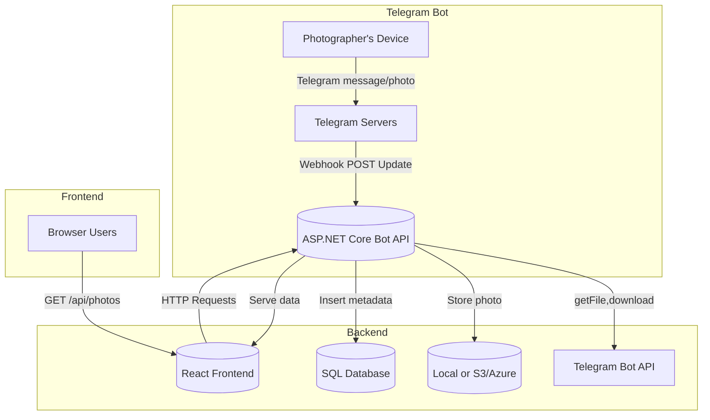
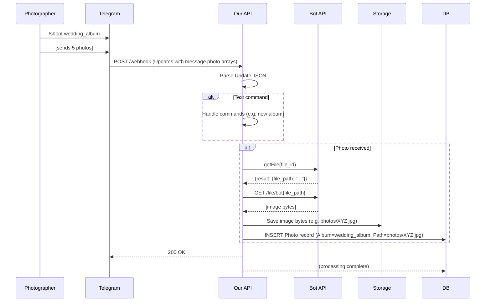
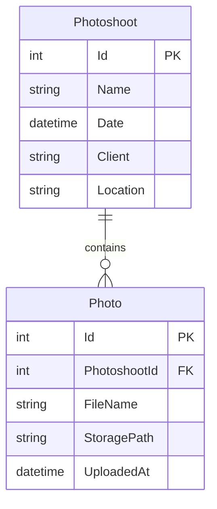
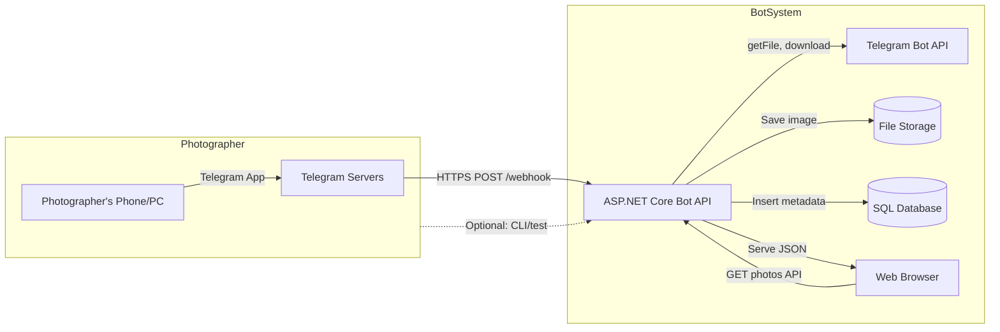
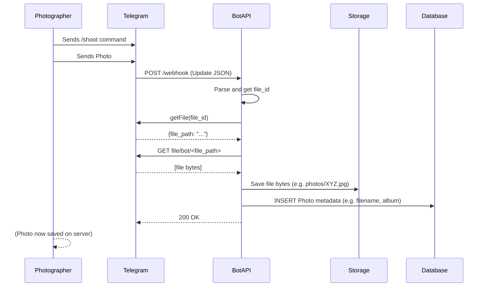

# SY Photography Site – Developer Handbook

## Executive Summary  
This document provides a **comprehensive developer guide** for implementing a Telegram-based CMS and ASP.NET Core backend for the SY Photography site. It covers system architecture, Telegram Bot API webhooks, ASP.NET Core controller code, ngrok tunneling, storage options, database schema, CI/CD and deployment notes, security, and troubleshooting. The goal is to enable the development of a robust photo-upload and gallery system where the photographer (or wife) can send photos via Telegram to update the website gallery, with minimal manual intervention.

Key points:
- **Telegram Webhook:** We use Telegram’s outgoing webhook to receive updates (messages, photos, documents, button presses) in real time. Telegram sends an HTTPS POST with a JSON-serialized `Update` object to our webhook URL.
- **ASP.NET Core API:** A Web API endpoint (e.g. `POST /api/telegram/webhook`) processes incoming `Update` JSON, extracts media file IDs, downloads files via the Bot API (using `getFile`/`file_path`), and saves them to storage (local or cloud). We handle commands (e.g. `/shoot`), enforce an allowed-user policy, and log activity.
- **ngrok for Local Testing:** During development, [ngrok](https://ngrok.com/) is used to expose `https://localhost:{port}` to a public URL, allowing Telegram to reach our local webhook. We must configure `ngrok` correctly (often `ngrok http {port}` or `ngrok http https://localhost:{port} --host-header=localhost:{port}`) to avoid errors like `ERR_NGROK_3004`.
- **Storage Options:** Photos can be stored on the local server (easy but not scalable), or in cloud object storage like **AWS S3** or **Azure Blob Storage**. Cloud storage offers high durability, scalability, and CDN integration, at the cost of external dependency and network latency. We provide a comparison table of local vs S3 vs Azure (cost, throughput, durability).
- **Database Schema:** We use a simple relational schema. For example, a `Photoshoot` table (Id, Name, Date, Client, etc.) and a `Photo` table (Id, PhotoshootId FK, FileName, StoragePath, UploadedAt). A Mermaid ER diagram illustrates this schema.
- **Security:** We store the Telegram Bot token securely (e.g. in environment variables or user secrets) and whitelist the authorized user/chat ID. Optionally, we use Telegram’s `secret_token` header to verify requests.
- **CI/CD & Deployment:** We suggest using **GitHub Actions** (or equivalent) to build and publish the .NET API and deploy to a hosting platform (e.g. Azure App Service, AWS Elastic Beanstalk, Docker container). A sample workflow can build with `dotnet publish` and deploy via the official Azure Web App action. The front-end React app can be deployed as static files to services like Netlify, Vercel, or S3+CloudFront.
- **Troubleshooting:** We include common issues (HTTP 404, 502, ngrok errors) and how to debug them using `ngrok`’s web inspector (http://127.0.0.1:4040) and Telegram’s `getWebhookInfo` for error messages.
- **Checklist:** At the end, a concise checklist ensures all steps are covered (e.g. bot creation, local server running, webhook set, messages sent, photos saved).

All code examples, curl commands, JSON payloads and diagrams are provided. References to Telegram and ASP.NET documentation are included for accuracy and further reading.

## 1. Project Overview  
- **Objectives:** Build a photo gallery website for a wedding photographer. The site shows albums/galleries of photos. The photographer can *upload photos via Telegram* to create/update albums, replacing the need for a web admin UI.  
- **Components:** 
  - *Telegram Bot:* Receives messages/photos from the photographer. 
  - *ASP.NET Core Backend:* Exposes a webhook endpoint and REST APIs. Downloads photos from Telegram and stores them, and serves gallery data to the front-end. 
  - *Database:* Stores metadata (albums, photo records). 
  - *Storage:* Saves actual image files (local disk, S3, or Azure Blob). 
  - *React Frontend:* Fetches photo lists from the API and displays them. 
  - *Instagram Integration:* (Optional) An Instagram client that publishes photos (was part of earlier discussion). Not covered here.  
- **Architecture Diagram:**  



*Sequence of a photo upload:*  



## 2. Telegram Bot API – Webhooks and Updates  

### 2.1 Setting Up a Webhook  
To receive messages from your bot, Telegram must be told your public webhook URL. Use `setWebhook`: 

```bash
curl -X GET "https://api.telegram.org/bot<YourBotToken>/setWebhook?url=https://<your-host>/api/telegram/webhook"
```
  
- **URL requirements:** Must be HTTPS (TLS 1.2+), port 443 (or 80, 88, 8443). ngrok provides an HTTPS URL. 
- **drop_pending_updates (optional):** use `&drop_pending_updates=true` if you want to discard any queued updates.
- **secret_token (optional):** Pass a random string via `&secret_token=XYZ`. Telegram will include it in the header `X-Telegram-Bot-Api-Secret-Token` for verification.
- **Certificate (rare):** If you use a self-signed server certificate, use the `certificate` parameter to upload your public key when calling `setWebhook`. (ngrok’s domain has a valid cert so this isn’t needed).
- Once set, Telegram will POST each new `Update` to that URL (as JSON).

Check webhook status:  
```bash
curl -X GET "https://api.telegram.org/bot<YourBotToken>/getWebhookInfo"
```
This returns a `WebhookInfo` object (see below). If `url` is set and no errors, webhook is active. 

Remove webhook (to switch to polling):  
```bash
curl -X GET "https://api.telegram.org/bot<YourBotToken>/deleteWebhook"
```
.

### 2.2 Update Payload  
Telegram sends an **Update** JSON object. Key fields (all optional except `update_id`):

- `update_id` (int) – sequential ID of the update.
- **Message types:** If the user sent a message or photo, the object has a `message` field (type `Message`). Other top-level fields include `edited_message`, `channel_post`, `callback_query`, etc., depending on action.
- **Example: Text Message:** When a user sends text, the Update might be:  
  ```json
  {
    "update_id": 1001,
    "message": {
      "message_id": 50,
      "from": { "id": 123456789, "first_name": "Jane" },
      "chat": { "id": 123456789, "type": "private" },
      "date": 1650000000,
      "text": "Hello bot!"
    }
  }
  ```
- **Example: Photo Message:** For a photo upload, Telegram sends `message.photo` as an array of different sizes. The highest-resolution photo is the last element. Example:
  ```json
  {
    "update_id": 1002,
    "message": {
      "message_id": 51,
      "from": {"id": 123456789},
      "chat": {"id": 123456789},
      "date": 1650000005,
      "photo": [
        {"file_id": "AAA", "file_unique_id": "xxx", "file_size": 23456, "width": 90, "height": 90},
        {"file_id": "BBB", "file_unique_id": "yyy", "file_size": 123456, "width": 320, "height": 320},
        {"file_id": "CCC", "file_unique_id": "zzz", "file_size": 345678, "width": 640, "height": 640}
      ]
    }
  }
  ```
  You should use the last element’s `file_id` (here `"CCC"`) for highest quality.
- **Example: Document (file) Message:** If a user sends as a file, the Update has `message.document`:
  ```json
  {
    "update_id": 1003,
    "message": {
      "message_id": 52,
      "from": {"id": 123456789},
      "chat": {"id": 123456789},
      "date": 1650000010,
      "document": {
        "file_id": "DOC123",
        "file_name": "photo.jpg",
        "mime_type": "image/jpeg",
        "file_size": 456789
      }
    }
  }
  ```
- **Example: Callback Query:** If the bot had inline keyboard buttons, clicking one yields a `callback_query` Update:
  ```json
  {
    "update_id": 1004,
    "callback_query": {
      "id": "134567890",
      "from": {"id": 123456789, "first_name": "Jane"},
      "message": { "message_id": 53, "chat": {"id": 123456789} },
      "data": "button_clicked"
    }
  }
  ```
  (The `data` is the callback data you set in the button.)
  
In all cases, **the JSON body is key**. Telegram sends one `Update` per HTTP POST. In your ASP.NET controller, you will typically receive it as raw JSON (for example into a `JsonElement` or a typed `Update` model).  

**Note:** Telegram expects your webhook to return `200 OK` quickly. If your endpoint does not respond or returns non-2xx, Telegram will retry the same update (initially quickly, then with backoff) until success. Avoid long processing before responding.  

### 2.3 WebhookInfo  
The `getWebhookInfo` method returns a `WebhookInfo` JSON, e.g.:
```json
{
  "ok": true,
  "result": {
    "url": "https://xyz.ngrok.io/api/telegram/webhook",
    "has_custom_certificate": false,
    "pending_update_count": 3,
    "last_error_date": 1650000100,
    "last_error_message": "404 Not Found",
    "max_connections": 40
  }
}
```
Fields:
- `url`: your webhook URL (empty if unset).
- `pending_update_count`: how many updates awaiting delivery.
- `last_error_date`, `last_error_message`: if Telegram encountered an error (like 404), these fields show details.
- Use this to diagnose webhook setup issues. For example, a 404 means your route isn’t matched.

## 3. ASP.NET Core Implementation  

### 3.1 Controller and Program.cs Setup  
We create an API controller to receive webhook posts. For example, in `TelegramController.cs`:

```csharp
[ApiController]
[Route("api/telegram")]
public class TelegramController : ControllerBase
{
    private readonly ILogger<TelegramController> _logger;
    private readonly IHttpClientFactory _httpClientFactory;
    private readonly IConfiguration _config;

    public TelegramController(
        ILogger<TelegramController> logger, 
        IHttpClientFactory httpClientFactory,
        IConfiguration config)
    {
        _logger = logger;
        _httpClientFactory = httpClientFactory;
        _config = config;
    }

    [HttpPost("webhook")]
    public async Task<IActionResult> Webhook([FromBody] JsonElement updateJson)
    {
        _logger.LogInformation(updateJson.ToString());

        // Only process updates that have a "message" field
        if (!updateJson.TryGetProperty("message", out var message))
            return Ok();

        // Security: ensure the message is from the authorized user
        long fromId = message.GetProperty("from").GetProperty("id").GetInt64();
        if (fromId.ToString() != _config["Telegram:AllowedUserId"])
            return Forbid();

        // Handle text commands
        if (message.TryGetProperty("text", out var textProp))
        {
            string text = textProp.GetString();
            // TODO: handle commands like /shoot albumName
            // e.g., set current album context, etc.
        }

        // Handle photo array (as compressed photos)
        if (message.TryGetProperty("photo", out var photoArray))
        {
            var largestPhoto = photoArray[photoArray.GetArrayLength() - 1];
            string fileId = largestPhoto.GetProperty("file_id").GetString();
            await DownloadAndSaveFile(fileId);
        }

        // Handle document (file upload)
        if (message.TryGetProperty("document", out var doc))
        {
            string fileId = doc.GetProperty("file_id").GetString();
            await DownloadAndSaveFile(fileId);
        }

        return Ok();
    }

    private async Task DownloadAndSaveFile(string fileId)
    {
        var token = _config["Telegram:BotToken"];
        var client = _httpClientFactory.CreateClient();

        // Step 1: get file info (path)
        var fileInfoResp = await client.GetAsync($"https://api.telegram.org/bot{token}/getFile?file_id={fileId}");
        fileInfoResp.EnsureSuccessStatusCode();
        using var doc = JsonDocument.Parse(await fileInfoResp.Content.ReadAsStringAsync());
        string filePath = doc.RootElement.GetProperty("result").GetProperty("file_path").GetString();

        // Step 2: download file bytes
        var fileUrl = $"https://api.telegram.org/file/bot{token}/{filePath}";
        var fileBytes = await client.GetByteArrayAsync(fileUrl);

        // Step 3: save to storage (here local disk as example)
        Directory.CreateDirectory("photos");
        string fileName = Path.GetFileName(filePath);
        await System.IO.File.WriteAllBytesAsync($"photos/{fileName}", fileBytes);

        _logger.LogInformation($"Saved file {fileName}");
    }
}
```

**Notes on the code above:**  
- We log the raw JSON (`updateJson.ToString()`) for debugging.  
- We restrict processing to messages from our photographer by checking `from.id` against `AllowedUserId` (configure in *appsettings.json* or env).  
- We parse **text**, **photo**, and **document** fields separately. For photos, the `photo` property is a JSON array of sizes; we take the last element for highest resolution.  
- `DownloadAndSaveFile` uses `HttpClient` (from `IHttpClientFactory`) to call `getFile` and then download the image. We call `EnsureSuccessStatusCode()` so that failures throw.  
- Adjust file paths/names as needed (e.g. add GUIDs, date folders, etc).  

In `Program.cs` (ASP.NET 6 or later), configure services and routing:  
```csharp
var builder = WebApplication.CreateBuilder(args);
builder.Services.AddControllers();
builder.Services.AddHttpClient();
builder.Services.AddSingleton<ITelegramService, TelegramService>(); // if you have a separate service
var app = builder.Build();
app.MapControllers();
app.Run();
```  
Ensure `app.MapControllers()` is called, otherwise routes return 404.  

Also, store sensitive settings in configuration:
- **BotToken:** Put in *appsettings.json* (or environment variable) as `"Telegram": { "BotToken": "<token>", "AllowedUserId": "<yourId>" }`.  
- For production, use environment variables or Azure Key Vault rather than plaintext files.

### 3.2 JSON Serialization  
By default, ASP.NET Core’s JSON serializer expects PascalCase. Telegram JSON uses `snake_case`. The Telegram.Bot library provides helpers (e.g. `services.ConfigureTelegramBotMvc()`), but since we parse `JsonElement` manually here, it’s not needed. If you use typed models (`Telegram.Bot.Types.Update`), ensure JSON options allow snake_case. For simplicity we used `JsonElement` above.

### 3.3 Error Handling and Logging  
We wrap our logic in try/catch (not shown above) and return `BadRequest` or `500` if something fails. Always respond quickly with `Ok()` on success to avoid Telegram retry. Log exceptions via `ILogger`. For example:
```csharp
try {
    // ... process ...
    return Ok();
}
catch(Exception ex) {
    _logger.LogError(ex, "Error in Telegram webhook");
    return StatusCode(500, "Internal error");
}
```

### 3.4 HTTP Client Configuration  
Using `IHttpClientFactory` (registered via `AddHttpClient()`) is recommended for efficient reuse. You may add transient error-handling or Polly policies if needed, but for this project the simple approach suffices.

## 4. Storage Options

Photos must be stored durable and served to the website. Options include local disk, or cloud object storage (AWS S3, Azure Blob, etc). Below is a summary:

| **Storage**        | **Pros**                                                                | **Cons**                                                                                           |
|--------------------|-------------------------------------------------------------------------|----------------------------------------------------------------------------------------------------|
| **Local Disk**     | Zero extra cost, very fast I/O on same server, simple to code          | Limited capacity (server disk), single point of failure (need backups), not scalable horizontally. Harder if API scales out. |
| **AWS S3**         | Extremely durable (11×9's durability), virtually unlimited scale, built-in versioning, global CDN support (via CloudFront), fine-grained IAM controls. Pay-as-you-go. | Requires AWS account; has storage and request costs. Higher latency (network) than local disk. SDK setup needed. Dependency on AWS availability.                |
| **Azure Blob**     | Highly durable, supports hot/cool/archive tiers for cost optimization, integrates with Azure CDN, supports snapshots/versions, RBAC/SAS for access. Good if already on Azure. | Similar drawbacks to S3 (cost, network latency). Different API/SDK if on AWS vs Azure.                                           |

*Pros/Cons details:*  
- **Durability:** Cloud object stores replicate data; e.g. S3 provides 99.999999999% durability. Local storage lacks such redundancy.  
- **Cost:** Local is “free” aside from server cost; cloud costs scale with usage.  
- **Performance:** Local has lowest latency (no network). Cloud access is slower but often acceptable for web.  
- **Scalability:** Cloud storage handles any size/throughput; local is bounded by one machine.

A simplified **comparison table**:

| Aspect               | Local Disk                        | AWS S3                             | Azure Blob                         |
|----------------------|-----------------------------------|------------------------------------|------------------------------------|
| Durability           | Self-managed (backup needed)      | 99.999999999% durability | Similarly high (redundant tiers)   |
| Scalability          | Limited by server capacity        | Virtually unlimited                | Virtually unlimited                |
| Cost                 | One-time hardware cost            | Pay-per-GB (storage + requests)    | Pay-per-GB + transactions          |
| Latency/Performance  | Lowest (local I/O) | Higher (internet, but CDN/CDN)     | Higher (internet)                  |
| Setup complexity     | Simple (file I/O)                | Medium (AWS SDK/credentials)       | Medium (Azure SDK/credentials)     |
| Access (public)      | Need own server or CDN setup      | Built-in URL access / S3 website   | Built-in (with SAS tokens/ACLs)    |
| Example use-case     | Dev testing, small apps           | Large-scale, global distribution   | Large-scale, Azure-native apps     |

## 5. Database Schema

A simple relational schema suffices. For example, we have **Albums/Photoshoots** and **Photos**:



- **Photoshoot (Album):** fields like `Id`, `Name` (e.g. "wedding_ana"), `Date`, `Client`, etc.  
- **Photo:** each record has `Id`, foreign key `PhotoshootId`, `FileName` (original name or generated), `StoragePath` (e.g. “photos/IMG123.jpg” or S3 URL), and timestamp `UploadedAt`.  
- In SQL, define a foreign key constraint from `Photo.PhotoshootId` to `Photoshoot.Id`.  

This lets the website query all photos for an album.

## 6. ngrok Local Testing

To develop locally, you need Telegram to reach your *localhost* webhook. [ngrok](https://ngrok.com/) provides a secure tunnel.

1. **Install and Auth:** Download ngrok and run:  
   ```bash
   ngrok config add-authtoken <YourAuthToken>
   ```
2. **Run ASP.NET Core API:**  
   ```bash
   dotnet run
   ```  
   Note which port it listens on (e.g. `https://localhost:7143`).
3. **Start ngrok tunnel:**  
   ```bash
   ngrok http https://localhost:7143 --host-header=localhost:7143
   ```  
   OR if using HTTP endpoint:  
   ```bash
   ngrok http 7143
   ```  
   This outputs something like:  

   ```
   Forwarding    https://abcd1234.ngrok.io -> https://localhost:7143
   Forwarding    http://abcd1234.ngrok.io  -> http://localhost:7143
   ```
4. **Set webhook URL:**  
   Use the HTTPS forwarding URL from ngrok:  
   ```bash
   curl "https://api.telegram.org/bot<TOKEN>/setWebhook?url=https://abcd1234.ngrok.io/api/telegram/webhook"
   ```  
   Telegram replies `{"ok":true,...}`.
5. **Use ngrok inspector:** Open `http://127.0.0.1:4040` in browser to see real-time requests and responses. Useful for debugging.

**Important:** Free ngrok URLs are ephemeral and show a browser warning page on first request. Use `--host-header` to avoid SSL mismatch. If you see `ERR_NGROK_3004`, try not forcing HTTPS or change host-header. For example, one workaround is simply `ngrok http 7143` without `https://`, which resolved the issue for some.  

## 7. Troubleshooting Common Issues

- **404 Not Found on webhook POST:**  
  - Check your controller route and `MapControllers()`. The endpoint must match `/api/telegram/webhook` (for the above route).  
  - Test via browser: open `https://abcd1234.ngrok.io/api/telegram/webhook` – you should get a 405 Method Not Allowed (if GET is not allowed), not 404. 404 means the route didn’t match.  
  - In `getWebhookInfo`, `last_error_message` may show `"404 Not Found"`.
- **ERR_NGROK_3004 (ngrok gateway error):**  
  - Usually caused by ngrok tunneling the wrong port or protocol. If your app listens on HTTPS, ensure `ngrok http https://localhost:PORT` with `--host-header=localhost:PORT`. In some cases, simply use `ngrok http PORT` instead of specifying HTTPS.  
  - Also, free ngrok displays a security warning page (first visit). This can block your URL from loading normally. To skip this, either upgrade ngrok plan or use the header `ngrok-skip-browser-warning: true` (for browser requests). However, Telegram’s POSTs aren’t affected by this warning.
- **502 Bad Gateway:**  
  - Could occur if your local server isn’t running or responded with error. Check your app logs.  
  - Verify your app can be reached directly (e.g. `curl https://localhost:7143/api/telegram/webhook`).  
  - Self-signed cert issues: If using `https://localhost`, make sure ngrok uses `--host-header` to avoid TLS name mismatch.  
- **Bot not responding / no updates:**  
  - Did you press **Start** in the Telegram chat? Bots only receive messages after a user sends `/start`.  
  - Check Telegram’s pending updates count with `getWebhookInfo`.  
  - Use Postman or curl to send test JSON (see next section) to verify your endpoint.

- **Debugging with ngrok:** Use `http://127.0.0.1:4040` to inspect each webhook request. It shows headers, JSON body, and response code. This quickly reveals issues (wrong JSON path, exceptions, etc).

## 8. Testing with Postman / curl

Before using the actual bot, you can simulate a Telegram Update. For example:

```bash
curl -X POST https://abcd1234.ngrok.io/api/telegram/webhook \
  -H "Content-Type: application/json" \
  -d '{
        "update_id": 9999,
        "message": {
            "message_id": 1,
            "from": {"id": 123456789, "first_name": "Jane"},
            "chat": {"id": 123456789, "type": "private"},
            "date": 1650001000,
            "text": "test"
        }
     }'
```

The ASP.NET controller should log the JSON. You’ll get `200 OK` if configured correctly. Adjust JSON to include `"photo": [...], "document": {...}, or "callback_query": {...}` to test other handlers.

## 9. Webhook Registration Commands

Use Telegram’s HTTP API to manage the webhook. Examples with `curl`:

```bash
# Set webhook (replace <NGROK_URL> and BOT_TOKEN)
curl -X GET "https://api.telegram.org/bot<BOT_TOKEN>/setWebhook?url=https://<NGROK_URL>/api/telegram/webhook"

# Delete webhook (stops webhook updates)
curl -X GET "https://api.telegram.org/bot<BOT_TOKEN>/deleteWebhook"

# Get webhook info (status, errors)
curl -X GET "https://api.telegram.org/bot<BOT_TOKEN>/getWebhookInfo"
```

Alternatively, you can embed this in code using `HttpClient` in C# or use the `Telegram.Bot` library’s `SetWebhookAsync` method. Always verify the webhook info after setting it.

## 10. Continuous Integration / Deployment

- **Front-End:** The React app (Vite/TypeScript) is a static site. Deploy to any static host (Netlify, Vercel, GitHub Pages) or S3 + CloudFront. CI (e.g. GitHub Actions) should run `npm install && npm run build` and publish `dist` to your hosting service.  
- **Back-End (ASP.NET):** Containerize or deploy to a .NET host. Possible targets:
  - **Azure App Service:** Create an App Service, then use GitHub Actions. Example workflow (abridged):

    ```yaml
    name: Build and Deploy .NET to Azure
    on: [push]
    jobs:
      build:
        runs-on: ubuntu-latest
        steps:
          - uses: actions/checkout@v3
          - name: Setup .NET
            uses: actions/setup-dotnet@v3
            with: dotnet-version: '7.0'
          - run: dotnet publish -c Release -o ./myapp
          - uses: actions/upload-artifact@v4
            with: name: app-artifact
                  path: ./myapp
      deploy:
        runs-on: ubuntu-latest
        needs: build
        steps:
          - uses: actions/download-artifact@v2
            with: name: app-artifact
          - uses: azure/webapps-deploy@v2
            with:
              app-name: ${{ secrets.AZURE_APP_NAME }}
              publish-profile: ${{ secrets.AZURE_PUBLISH_PROFILE }}
              package: ./myapp
    ```
    This uses the Azure Web Apps Deploy action. Store your Azure publish profile in GitHub secrets `AZURE_PUBLISH_PROFILE`.  

  - **AWS Elastic Beanstalk / ECS / Lambda:** Similar approach, use AWS GitHub Actions or Elastic Beanstalk CLI in pipeline.  
  - **Docker:** Dockerize the API (`Dockerfile`) and push to a container registry. Deploy to any container host.

- **Configuration:** Use environment variables or Azure App Settings to store secrets (BotToken, AllowedUserId) rather than hardcoding. In Azure, add these under Configuration > Application Settings.

- **Domain & HTTPS:** When in production, point a domain (e.g. `api.sy-photography.com`) to your server or load balancer. Ensure a valid TLS certificate (Let’s Encrypt or hosted certificate). Use `setWebhook?certificate=` only if you have a self-signed certificate; usually you won’t need this if using standard certs or ngrok’s.

## 11. Security Best Practices  

- **Token Storage:** The Bot token is sensitive. Keep it in configuration, not in source. Use `.gitignore` or secrets storage (like `dotnet user-secrets`, or Azure Key Vault).  
- **AllowedUserId:** Only process updates from your photographer’s Telegram user ID (or chat ID). Any others should be ignored or `Forbid()`d. This prevents unauthorized users from spamming your API.
- **Webhook Secret:** As extra security, add a secret in your webhook URL or use the `secret_token` parameter when calling `setWebhook`. Telegram will then send that token in each request header for you to verify.
- **IP whitelisting:** Telegram’s IP ranges (`149.154.160.0/20`, `91.108.4.0/22`) are documented. You may, optionally, only allow requests from these IPs at your firewall. But note ngrok may use external IPs, so this is mostly for production.  
- **HTTPS:** Always use HTTPS for webhooks (ngrok provides it). For a real domain, obtain a valid cert. Do not use plain HTTP.

## 12. Mermaid Diagrams

### 12.1 Architecture Diagram  
*(Graphviz/Flowchart)*



### 12.2 Sequence Diagram  
*(Simplified request flow)*



### 12.3 Database ER Diagram


## 13. Final Checklist

- [ ] **Bot Creation:** Created a new bot via BotFather; copied the Bot token.  
- [ ] **App Settings:** Added `Telegram:BotToken` and `Telegram:AllowedUserId` (your Telegram numeric ID) to configuration.  
- [ ] **Controller Endpoint:** Implemented `POST /api/telegram/webhook` in ASP.NET Core, with allowed-user check and handlers for text/photo/document.  
- [ ] **HttpClient:** Registered `IHttpClientFactory` (`builder.Services.AddHttpClient()`), used it to call `getFile` and download file.  
- [ ] **Logging:** Logging enabled (e.g. `ILogger`) to record incoming updates and errors.  
- [ ] **Storage:** Decided on storage (e.g. local `photos/` folder, or S3 bucket). Configured saving files there.  
- [ ] **Database:** Created tables (Photoshoot and Photo) with a suitable ORM or SQL. Linked to photo storage.  
- [ ] **ngrok Tunnel:** ngrok installed and auth token set. Run `ngrok http <API port>`. Copied the HTTPS forwarding URL.  
- [ ] **Webhook Setup:** Called `setWebhook?url=https://<ngrok-id>.ngrok.io/api/telegram/webhook`. Confirmed via `getWebhookInfo`.  
- [ ] **Testing:** Sent `/start` and messages to the bot from your Telegram. Observed the webhook hits in ngrok inspector. Confirmed files are downloaded and stored.  
- [ ] **Error Handling:** Verified no lingering errors (`getWebhookInfo`). Tested unauthorized user scenario. Checked ASP.NET logs for exceptions.  
- [ ] **Deployment:** Dockerized or prepared a deployment plan. Set up CI pipeline (e.g. GitHub Actions) to build and deploy the API and front-end.  
- [ ] **HTTPS & Domain:** If on production, pointed a domain to the server and ensured a valid SSL certificate. Updated `setWebhook` URL accordingly.  

## Sources

- Telegram Bot API docs (official)  
- Telegram Webhooks Guide (Marvin’s Guide)  
- Telegram.Bot .NET library guide (for webhook handling example)  
- ngrok documentation and troubleshooting  
- Storage comparisons (AWS S3 vs Azure Blob)  
- Cloud vs Local storage pros/cons  
- GitHub Actions & Azure App Service deployment  

