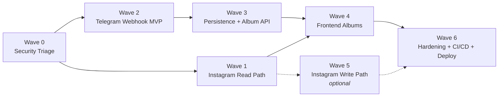

# SY Photography — Project Review & Action Plan

> **Date:** 2026-08-03
> **Last status update:** 2026-08-06
> **Scope reviewed:** `markdowns/gpt-deep-research-report.md` (Developer Handbook), `sy_api/` (.NET backend: API, Infrastructure, Service), `sy_website/` (React frontend), `.github/`
> **Review method:** Dual-perspective review — Software Architect (alignment & design) and Senior Software Engineer (implementation status & gaps) — followed by a wave-based action plan.

---

## Table of Contents

1. [Part 1 — Software Architect Review](#part-1--software-architect-review)
2. [Part 2 — Senior Software Engineer Review](#part-2--senior-software-engineer-review)
3. [Part 3 — Action Plan (Waves)](#part-3--action-plan-waves)
4. [Part 4 — Testing Strategy](#part-4--testing-strategy)
5. [Appendix — Issue Register](#appendix--issue-register)

---

# Part 1 — Software Architect Review

## 1.1 Is the project goal well written?

**Verdict: Yes — the handbook is strong. It is the best-defined artifact in the repository.**

The `gpt-deep-research-report.md` clearly states the goal:

> *"Build a photo gallery website for a wedding photographer. The photographer can upload photos via Telegram to create/update albums, replacing the need for a web admin UI."*

Strengths of the document:

| Aspect | Assessment |
|---|---|
| Objective clarity | ✅ Clear actor (photographer), clear channel (Telegram), clear outcome (website galleries) |
| Architecture diagrams | ✅ Flowchart, sequence diagram, and ER diagram all consistent with each other |
| API contracts | ✅ Real Telegram `Update` payloads, `getFile` flow, webhook registration commands |
| Ops guidance | ✅ ngrok setup, troubleshooting matrix, CI/CD sketch, security checklist |
| Data model | ✅ Simple, correct `Photoshoot` → `Photo` (1:N) relational schema |

Minor documentation gaps:

- The doc says Instagram integration is *"Not covered here"* — but Instagram is currently the **primary implemented feature** (the website gallery is fed by Instagram, not Telegram). The doc should be updated to reflect the dual-source reality.
- No definition of how Telegram-uploaded albums get **served back to the website** (the API surface for `GET /albums`, `GET /albums/{id}/photos` is implied by the diagrams but never specified).
- CI/CD YAML sample has minor syntax problems (`with:` inline values) — fine as pseudocode, not copy-paste ready.

## 1.2 Is the code aligned with the documented goal?

**Verdict: Partially. The code follows the document's spirit but diverges on several key architectural commitments.**

### Alignment matrix — Handbook vs. Implementation

| Handbook commitment | Implemented? | Evidence |
|---|---|---|
| `POST /api/telegram/webhook` endpoint | ⚠️ Exists but **disabled** | [TelegramController.cs](../sy_api/API/Controllers/TelegramController.cs) — service call commented out, returns bare `Ok()` |
| Allowed-user whitelist check | ❌ Not enforced | `ALLOWED_USER_ID` is read in [TelegramService.cs](../sy_api/Service/Services/TelegramService.cs) constructor but never compared to the sender |
| `getFile` → download → save pipeline | ⚠️ Written but **broken** | `DownloadFile` formats the *file-download* URL template for the *getFile-info* call; `GET_FILE_INFO_URL` is declared and never used |
| `secret_token` webhook verification | ❌ Absent | No header check anywhere |
| Database (`Photoshoot`, `Photo` tables) | ❌ Absent | No EF Core, no DbContext, no migrations, no SQL — 0% of the documented schema exists |
| Storage abstraction (local / S3 / Azure) | ❌ Local-disk only, hardcoded | `"PhotoStoragePath": "C:\\photo-storage"` in appsettings — no abstraction layer |
| Secrets outside source control | ❌ **Violated** | Live `Instagram:Token` and `Telegram:BotToken` committed in [appsettings.json](../sy_api/API/appsettings.json) |
| React frontend fetches gallery from API | ⚠️ Broken contract | Frontend calls `GET /instagram/posts` — **this route does not exist** in `InstagramController`; posts are only fetched inside stubbed POST endpoints |
| CI/CD pipeline | ❌ Absent | `.github/workflows` is empty |
| Return 200 quickly to Telegram | ✅ (trivially) | Because the webhook does nothing |

### Architectural observations

1. **Layering is right, the content isn't.** The API → Service → Infrastructure split is a sound choice and matches the handbook. However, `InstagramService` is a pure pass-through facade (zero business logic), so today the layering only adds indirection. This is acceptable scaffolding *if* logic lands in the Service layer next — it must not stay hollow.

2. **The document's core data flow is unimplemented.** The handbook's central diagrams (webhook → download → storage → **DB** → website) break at the DB step and at the "serve gallery data" step. There is no persistence and no read API for Telegram albums. The website currently only reflects Instagram.

3. **Stateful singleton anti-pattern.** `CurrentAlbum.Name` is a `static` mutable string used as session state for the `/shoot` command. This contradicts the handbook's stateless webhook design, is not thread-safe, and will corrupt album assignment with concurrent or out-of-order updates. Album context must live in persistent storage keyed by chat ID.

4. **Contract mismatch between webhook model and Telegram's schema.** `TelegramRequest`/`TelegramMesssage` (note the typo) are hand-rolled and do not map to Telegram's actual snake_case `Update` JSON (`message.from.id`, `message.photo[].file_id`, etc.). The controller binds `JsonElement` and never maps it. Even if the controller line were uncommented, deserialization would fail. The handbook explicitly documents the correct payload shape — the code ignores it.

5. **Naming drift.** Namespaces mix `MetaAPI`, `InstagramAPI`, `MetaService`, `Service`, `Infrastructure`; the Dockerfile builds/runs `MetaAPI.csproj` / `MetaAPI.dll` while the project on disk is `API.csproj`. The Docker image will not build as written.

6. **Security posture contradicts the handbook's own Section 11.** Committed live tokens, CORS `AllowAnyOrigin`, no webhook secret, no user check. All four are explicitly warned against in the document.

### Architect's summary

The **vision is well-written and coherent**; the codebase is an early proof-of-concept that has drifted from it in the places that matter most: persistence, security, the webhook contract, and the frontend/backend API contract. Nothing in the architecture needs to be redesigned — it needs to be **finished according to the existing document**, plus one documentation update (acknowledge Instagram as a first-class source and specify the album read API).

---

# Part 2 — Senior Software Engineer Review

## 2.1 What has been built (inventory)

### Backend — `sy_api/` (3 projects, .NET 10)

| Area | State | Detail |
|---|---|---|
| Solution structure | ✅ Done | API → Service + Infrastructure references wired; DI, `IOptions<T>`, typed `HttpClient`s registered in [Program.cs](../sy_api/API/Program.cs) |
| Swagger / OpenAPI | ✅ Done | Enabled in Development |
| Instagram read endpoints | 🟡 ~70% | `GET /instagram`, `/instagram/id`, `/instagram/profile-info/*` work end-to-end; responses are raw JSON passthrough; `{id}` route params sometimes ignored |
| Instagram client (Infrastructure) | 🟡 ~60% | 11 methods; `GetPostsAsync()` ends in an unreachable `throw new NotImplementedException()`; `UploadPostAsync` has hardcoded test caption and missing form fields |
| Instagram write endpoints | 🔴 Stubs | `media-upload`, `media-publish`, `media-comment` all call `GetPostsAsync()` instead of their real logic; ~80 lines of the real logic sit commented out in the controller |
| Telegram webhook endpoint | 🔴 Stub | Controller returns `Ok()`; `//await _service.Webhook(dto);` commented out; injected logger unused |
| Telegram service | 🟡 ~50% written, 0% working | `/shoot` command, download, save-to-disk, and reply logic all drafted — but URL bug + no request mapping + static album state mean it has never worked end-to-end |
| Database | 🔴 0% | Nothing |
| Tests | 🔴 0% | No test projects |
| Docker | 🟡 | Multi-stage Dockerfile present but references non-existent `MetaAPI.csproj` — broken |

### Frontend — `sy_website/` (React 19 + Vite 7 + TS 5.9)

| Area | State | Detail |
|---|---|---|
| Layout (Navbar, Hero, About, Gallery, Footer) | ✅ Done | Single-page, Framer Motion animations, cohesive dark/gold design |
| Gallery + lightbox | ✅ Done | `react-photo-view`, loading/error states, video filtering, 12-post cap |
| API service layer | ✅ Done | [InstagramService.tsx](../sy_website/src/services/InstagramService.tsx) with `VITE_API_URL` env config |
| **API contract** | 🔴 **Broken** | Frontend calls `GET /instagram/posts` — backend has no such route |
| About section | 🟡 Placeholder | Unsplash stock images, generic bio |
| Telegram albums UI | 🔴 0% | No model, service, or component |
| Routing | 🟡 | `react-router-dom` installed, unused (single page) |
| Mobile responsiveness | 🟡 Partial | TODOs in CSS |
| Production build/deploy | 🔴 | Dockerfile is dev-only (`npm run dev`); no prod stage, no nginx |
| CI/CD | 🔴 0% | `.github/workflows` empty |

## 2.2 Confirmed bugs (blocking)

| # | Bug | Location | Impact |
|---|---|---|---|
| B1 | Frontend endpoint `GET /instagram/posts` does not exist on backend | [Gallery.tsx](../sy_website/src/components/gallery/Gallery.tsx) ↔ [InstagramController.cs](../sy_api/API/Controllers/InstagramController.cs) | **Website gallery cannot load — the site's core feature is down** |
| B2 | `GetPostsAsync()` throws `NotImplementedException` after the HTTP call | [InstagramClient.cs](../sy_api/Infrastructure/Instagram/InstagramClient.cs) | Even a new `/instagram/posts` route would 500 |
| B3 | Webhook service call commented out | [TelegramController.cs](../sy_api/API/Controllers/TelegramController.cs) | Telegram flow entirely inert |
| B4 | `DownloadFile` uses `FILE_URL` for the `getFile` info call; `GET_FILE_INFO_URL` never used | [TelegramService.cs](../sy_api/Service/Services/TelegramService.cs) | File download would fail on first request |
| B5 | Controller binds raw `JsonElement`; `TelegramRequest` model doesn't match Telegram's snake_case `Update` schema and no mapping exists | TelegramController / TelegramRequest.cs | Webhook payload can never reach the service correctly |
| B6 | Dockerfile references `MetaAPI.csproj` / `MetaAPI.dll`; project is `API.csproj` | [Dockerfile](../sy_api/API/Dockerfile) | API image does not build |
| B7 | `AllowedUserId` never validated | TelegramService.cs | Anyone who finds the bot can write to disk on the server |
| B8 | Static mutable `CurrentAlbum.Name` shared across all requests | TelegramRequest.cs | Race conditions; photos land in wrong albums |

## 2.3 Security findings (must fix before any deployment)

1. 🔴 **Live secrets committed to git** — `Instagram:Token`, `Telegram:BotToken` in `appsettings.json`. Both must be **revoked/rotated immediately** (git history retains them even after removal).
2. 🔴 **No webhook authentication** — no `secret_token` header check, no sender whitelist enforcement.
3. 🔴 **CORS `AllowAnyOrigin` + `AllowAnyHeader` + `AllowAnyMethod`**.
4. 🟠 Exceptions returned to clients via `BadRequest(e.Message)` — internal detail leakage; no logging.
5. 🟠 No input validation on DTOs; file names from Telegram used without sanitization (path-traversal risk once webhook is live).

## 2.4 Effort assessment

| Layer | Complete | Remaining work |
|---|---|---|
| Handbook / docs | ~92% | Update Instagram scope, specify album read API |
| Backend — Instagram read path | ~85% | Typed responses, response caching, and end-to-end frontend verification |
| Backend — Instagram write path | ~20% | Uncomment/rewrite upload, publish, comment using the Service layer |
| Backend — Telegram pipeline | ~70% | Telegram schema parity (`JsonPropertyName`/typed `Update`), webhook `secret_token` verification, and ngrok E2E validation |
| Backend — Persistence | 0% | EF Core + SQLite/SQL Server, 2 tables, migrations |
| Backend — Photo serving API | 0% | `GET /albums`, `GET /albums/{id}/photos`, static file serving |
| Frontend — Instagram gallery | ~85% | Fix endpoint, real About content, mobile pass |
| Frontend — Telegram albums | 0% | Model, service, album grid + detail views (router) |
| Testing | ~35% | Expand Telegram service tests, add integration tests, add frontend tests |
| CI/CD & deploy | ~10% | Fix Dockerfiles, compose, GitHub Actions |
| **Overall** | **~50–55%** | Core backend contracts and security baseline improved; persistence, frontend albums, and deployment pipeline still missing |

---

# Part 3 — Action Plan (Waves)

Waves are ordered by dependency and risk. Each wave ends in a **verifiable, demoable state**. Do not start a wave until the previous wave's exit criteria pass.

---

## 🌊 Wave 0 — Security Triage (completed for now)

**Goal: stop the bleeding. No feature work until secrets are safe.**

- [x] **Revoke and regenerate** the Telegram bot token (BotFather → `/revoke`) and the Instagram access token (Meta dashboard). Both are burned — they exist in git history.
- [x] Move all secrets to **user secrets** (dev) — `dotnet user-secrets set "Telegram:BotToken" "..."` (the API project already has a UserSecretsId) — and environment variables (prod).
- [x] Strip secret values from `appsettings.json`, keeping only the keys with empty/placeholder values.
- [x] Add a note in the README about secret handling; verify `.gitignore` covers `.env.local`, `appsettings.*.Local.json`.
- [x] (Optional but recommended) Rewrite git history or accept rotation as sufficient mitigation.

**Exit criteria:** repo contains zero live credentials; API still boots with secrets from user-secrets.

> **Deployment reminder:** when the project is deployed, store production secrets in a managed secret store (for example Azure Key Vault, GitHub Actions secrets, or equivalent) and never commit them to the repository or bake them into container images.

---

## 🌊 Wave 1 — Make the Website Work (Instagram read path)

**Goal: the public site displays the real Instagram gallery end-to-end.**

Backend:
- [x] Fix `InstagramClient.GetPostsAsync()` — remove the unreachable `throw NotImplementedException()`, return the response body, and request the fields the frontend needs (`id,caption,media_url,permalink,media_type`).
- [x] Add the missing **`GET /instagram/posts`** endpoint to `InstagramController` calling `_service.GetPostsAsync()`.
- [ ] Add `[ApiController]` + `[Route]` attributes to `InstagramController`; pass the `{id}` route params through to the service instead of ignoring them.
- [x] Replace `BadRequest(e.Message)` with logged errors + `Problem()` responses.
- [x] Restrict CORS to the site origins (`localhost:3420`/`5173` in dev, real domain in prod).

Frontend:
- [ ] Confirm `VITE_API_URL` matches the API's actual port; verify Gallery renders live posts.
- [ ] Replace About-section Unsplash placeholders with real content/photos.

**Exit criteria:** `npm run dev` + `dotnet run` → homepage shows real Instagram posts; no CORS errors; API returns structured errors.

---

## 🌊 Wave 2 — Telegram Webhook MVP (upload photos to disk)

**Goal: photographer sends `/shoot album` + photos in Telegram → files land in the correct folder on the server.**

- [ ] Create proper Telegram request models matching the real `Update` schema (snake_case: `update_id`, `message.from.id`, `message.chat.id`, `message.text`, `message.photo[]`, `message.document`) using `[JsonPropertyName]` — or adopt the `Telegram.Bot` NuGet package types.
- [x] Map the incoming payload in `TelegramController` and **uncomment/wire the service call**.
- [x] Fix `DownloadFile`: use `GET_FILE_INFO_URL` for the `getFile` call and `FILE_URL` for the byte download.
- [x] **Enforce the whitelist**: reject updates where `from.id != Telegram:AllowedUserId` (return 200 to Telegram, log, and ignore — don't Forbid, to avoid retries).
- [ ] Verify the `X-Telegram-Bot-Api-Secret-Token` header against config; register the webhook with `secret_token`.
- [x] Replace `static CurrentAlbum.Name` with per-chat state (minimum: `ConcurrentDictionary<long chatId, string album>`; proper fix arrives with the DB in Wave 3).
- [x] Sanitize file names from Telegram (`Path.GetFileName`, strip invalid chars) before writing to disk.
- [ ] Move `PhotoStoragePath` to a configurable, non-hardcoded location; add try/catch + `ILogger` throughout the service.
- [ ] Fix the class-name typo `TelegramMesssage` → `TelegramMessage`.
- [ ] Test locally with ngrok following the handbook's Section 6, using the curl payloads from Section 8.

**Exit criteria:** real photo sent in Telegram appears under `{storage}/{album}/`; unauthorized sender is ignored; bot replies with confirmation messages; `getWebhookInfo` shows no errors.

---

## 🌊 Wave 3 — Persistence & Album API

**Goal: uploads are recorded in a database and served to the website.**

- [ ] Add EF Core (SQLite for dev is sufficient; SQL Server/Postgres for prod) with the handbook's schema: `Photoshoot` (Id, Name, Date, Client, Location) and `Photo` (Id, PhotoshootId FK, FileName, StoragePath, UploadedAt). Create initial migration.
- [ ] On `/shoot`, upsert a `Photoshoot`; store the active album per chat **in the DB** (replaces the Wave 2 in-memory dictionary).
- [ ] On each saved photo, insert a `Photo` row.
- [ ] Add read endpoints: `GET /api/albums` and `GET /api/albums/{id}/photos`.
- [ ] Serve stored images (static file middleware over the storage folder, or a `GET /api/photos/{id}/content` streaming endpoint).
- [ ] Introduce an `IPhotoStorage` abstraction (local-disk implementation now; S3/Azure Blob later without touching the service).

**Exit criteria:** photos sent via Telegram are queryable via the API with correct album grouping and viewable in a browser by URL.

---

## 🌊 Wave 4 — Frontend Albums Experience

**Goal: the website displays Telegram-uploaded albums alongside the Instagram feed.**

- [ ] Add `Album`/`Photo` TS models and an `AlbumService` calling the Wave 3 endpoints.
- [ ] Activate `react-router-dom`: home (current single page), `/albums` (grid of photoshoots), `/albums/:id` (photo grid + lightbox, reusing `react-photo-view`).
- [ ] Add nav link to albums; keep Instagram feed on home.
- [ ] Mobile-responsiveness pass (resolve the CSS TODOs in Hero/Gallery).
- [ ] Basic SEO: title/meta tags, og:image.

**Exit criteria:** end-to-end demo — send photos in Telegram → refresh site → new album visible and browsable on desktop and mobile.

---

## 🌊 Wave 5 — Instagram Write Path (optional scope — confirm before building)

**Goal: publish photos to Instagram from the system (the original `media-upload`/`publish`/`comment` intent).**

- [ ] Move the commented-out controller logic into `InstagramService`/`InstagramClient` properly (container create → publish two-step flow, `creation_id` passed not hardcoded).
- [ ] Fix `UploadPostAsync`: include `access_token`, `image_url`, real `caption`; remove test values.
- [ ] Wire the three POST endpoints to their real service methods; add DTO validation.
- [ ] Optionally: a Telegram command (e.g. `/publish`) that pushes an uploaded photo to Instagram — this closes the loop described in early project discussions.

**Exit criteria:** a photo can be published to the Instagram account through the API, verified on the profile.

---

## 🌊 Wave 6 — Hardening, CI/CD & Deployment

**Goal: production-ready.**

Build & deploy:
- [ ] Fix the API Dockerfile (`MetaAPI` → `API`); verify `docker build` succeeds.
- [ ] Add a production frontend Dockerfile (multi-stage: `npm run build` → nginx serving `dist/`).
- [ ] Add `docker-compose.yml` (api + web + volume for photo storage + db).
- [ ] GitHub Actions: workflow 1 — .NET build + test on push/PR; workflow 2 — frontend lint + build; workflow 3 — deploy on tag/main (target per handbook Section 10: Azure App Service or container host; frontend to Netlify/Vercel/S3).
- [ ] Production domain + TLS; re-register Telegram webhook to the production URL with `secret_token`.
- [ ] Before deployment, move all production secrets to a managed secret store (for example Azure Key Vault, GitHub Actions secrets, or equivalent) and confirm they are not exposed in config files, environment dumps, or container images.

Hardening:
- [ ] Structured logging throughout (all the "TODO: Add logging" items); remove dead/commented code blocks.
- [ ] Response caching on Instagram read endpoints (the existing `ResponseCache` TODO) to respect rate limits.
- [ ] Rate limiting on public endpoints; health-check endpoint (`/healthz`).
- [ ] Align namespaces (`MetaAPI`/`InstagramAPI`/`MetaService` → one consistent scheme) and clean orphaned `obj/` artifacts from old project names.
- [ ] Update the handbook: mark Instagram as in-scope, document the album API, check off the Section 13 checklist.

**Exit criteria:** green CI on main; one-command deploy; handbook checklist fully ticked.

---

## Wave dependency graph

---

# Part 4 — Testing Strategy

> **Maintenance rule:** after every merged PR, update `markdowns/testing-checklist.md` with the new test status, executed commands, and any newly testable or blocked areas.

## 4.1 Per-wave verification (manual smoke)

| Wave | Smoke test |
|---|---|
| 0 | `dotnet run` boots with user-secrets; grep repo for token strings returns nothing |
| 1 | Browser → homepage shows live Instagram posts; DevTools shows 200 from `/instagram/posts` |
| 2 | ngrok + real Telegram: `/shoot test` → confirmation reply; photo → file on disk; second Telegram account → ignored |
| 3 | `curl /api/albums` returns JSON with the test album; photo URL renders in browser |
| 4 | Full E2E: Telegram upload → album visible on site (desktop + mobile viewport) |
| 5 | Photo visible on the Instagram profile after API publish |
| 6 | CI green; `docker compose up` serves the full stack locally |

## 4.2 Automated tests (introduce from Wave 2 onward)

**Backend — unit tests** (xUnit + Moq or NSubstitute, new `sy_api/Tests` project):
- `TelegramService`: command parsing (`/shoot x`), whitelist rejection, file-name sanitization, URL construction (would have caught bug B4), photo-vs-document branching.
- `InstagramService`/`InstagramClient`: URL/route formatting, response mapping — mock `HttpMessageHandler`.

**Backend — integration tests** (`WebApplicationFactory`):
- `POST /api/telegram/webhook` with the handbook Section 8 sample payloads (text, photo, document, unauthorized user, missing secret header).
- `GET /instagram/posts` with a faked client.
- Album endpoints against SQLite in-memory.

**Frontend:**
- Vitest + React Testing Library: Gallery states (loading/error/success), AlbumService fetch mapping.
- Optional Playwright smoke: homepage renders, album navigation works.

**CI gates (Wave 6):** build + all tests on every PR; lint (`eslint`, `dotnet format`) enforced.

---

# Appendix — Issue Register

Consolidated, prioritized list of every issue found. IDs referenced throughout this document.

| ID | Sev | Status | Issue | File | Fix wave |
|----|-----|--------|-------|------|----------|
| S1 | 🔴 | ✅ Done | Live Instagram + Telegram tokens committed | sy_api/API/appsettings.json | 0 |
| S2 | 🔴 | ⏳ Missing | No webhook auth (secret token / whitelist) | TelegramController / TelegramService | 2 |
| S3 | 🔴 | ✅ Done | CORS AllowAnyOrigin | sy_api/API/Program.cs | 1 |
| B1 | 🔴 | ✅ Done | Frontend calls nonexistent `GET /instagram/posts` | Gallery.tsx ↔ InstagramController.cs | 1 |
| B2 | 🔴 | ✅ Done | `GetPostsAsync` unreachable `NotImplementedException` | InstagramClient.cs | 1 |
| B3 | 🔴 | ✅ Done | Webhook service call commented out | TelegramController.cs | 2 |
| B4 | 🔴 | ✅ Done | Wrong URL template in `DownloadFile` (`GET_FILE_INFO_URL` unused) | TelegramService.cs | 2 |
| B5 | 🔴 | ⏳ Missing | Webhook models don't match Telegram schema; no mapping | TelegramRequest.cs | 2 |
| B6 | 🔴 | ⏳ Missing | Dockerfile references `MetaAPI.csproj` (doesn't exist) | sy_api/API/Dockerfile | 6 |
| B7 | 🟠 | ✅ Done | `AllowedUserId` read but never enforced | TelegramService.cs | 2 |
| B8 | 🟠 | ✅ Done | Static mutable `CurrentAlbum.Name` (race conditions) | TelegramRequest.cs | 2→3 |
| Q1 | 🟠 | ⏳ Missing | 3 Instagram POST endpoints are stubs calling `GetPostsAsync` | InstagramController.cs | 5 |
| Q2 | 🟠 | ✅ Done | `{id}` route params ignored in service calls | InstagramController / InstagramService | 1 |
| Q3 | 🟠 | ✅ Done | Errors leaked via `BadRequest(e.Message)`, no logging | All controllers | 1 |
| Q4 | 🟡 | ⏳ Missing | No database / persistence (0% of documented schema) | — | 3 |
| Q5 | 🟡 | ⏳ Missing | Frontend Dockerfile is dev-only | sy_website/Dockerfile | 6 |
| Q6 | 🟡 | ⏳ Missing | `.github/workflows` empty — no CI | .github/ | 6 |
| Q7 | 🟡 | ⏳ Missing | About section uses Unsplash placeholders | About.tsx | 1 |
| Q8 | 🟡 | ⏳ Missing | Typo `TelegramMesssage`; namespace drift (MetaAPI/InstagramAPI/MetaService) | multiple | 2/6 |
| Q9 | 🟡 | ⏳ Missing | `react-router-dom` installed but unused | sy_website | 4 |
| Q10 | 🟡 | ⏳ Missing | ~130 lines of dead commented-out code | InstagramController.cs | 5/6 |
| Q11 | 🟡 | 🔄 In progress | No tests anywhere | — | 2+ |
| D1 | 🟡 | ⏳ Missing | Handbook says Instagram "not covered" but it's the main implemented feature; album read API unspecified | gpt-deep-research-report.md | 6 |

---

**Bottom line:** the project is a well-documented ~30–35%-complete proof of concept. The architecture is sound and doesn't need redesign — it needs its contracts honored (frontend↔API, webhook↔Telegram schema), a persistence layer, and immediate secret rotation. Following Waves 0–4 yields a fully working product; Waves 5–6 make it complete and production-grade.
